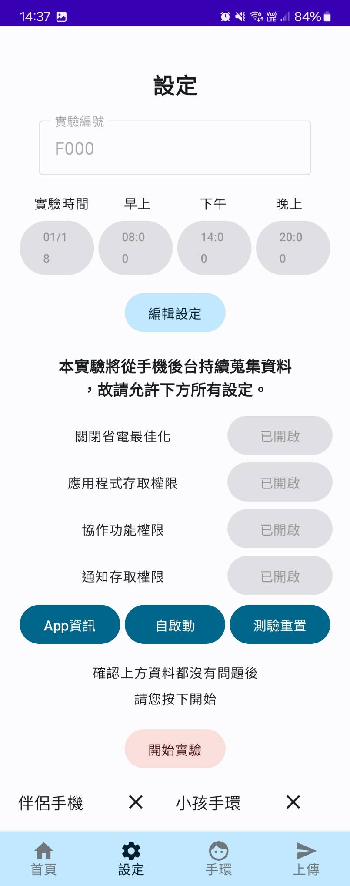
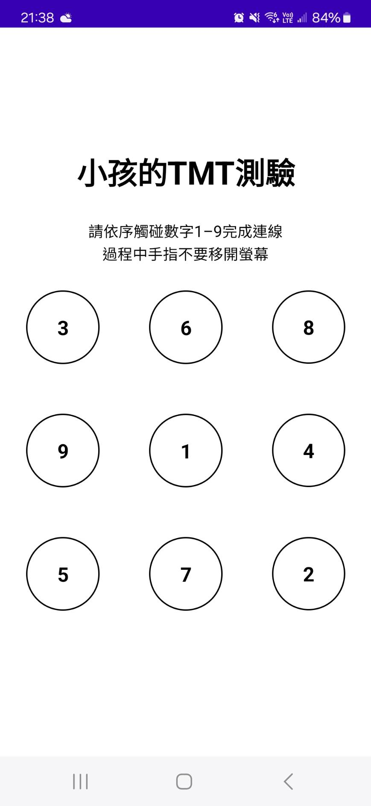
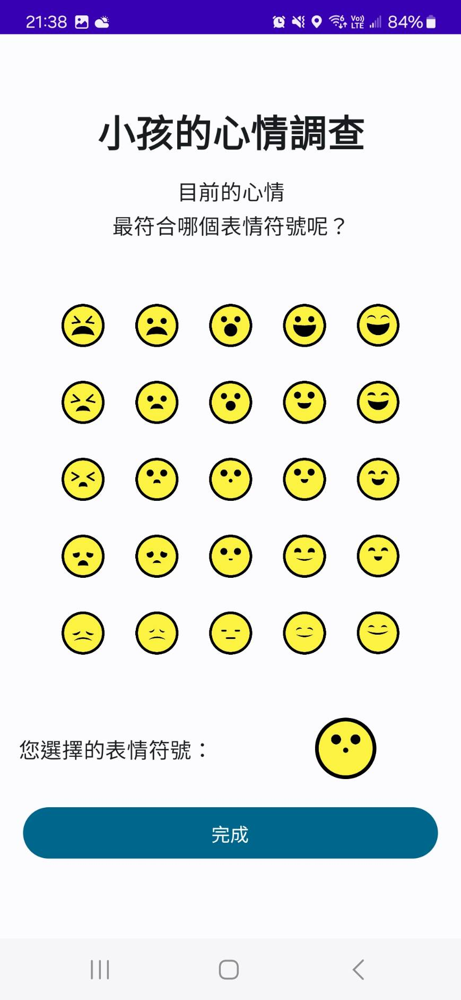

# Children's Wellbeing App

兒童幸福感應用程式是以 Kotlin 編寫的 Android 應用程式，透過控制藍芽掃描以估算對應手機與手環的物理距離，設定鬧鐘進行認知與情緒測驗，並以低干擾、連續的方式衡量使用者的生理、認知、情緒、社交等指標。

## 聲明

- 本應用程式僅用於研究目的，僅供研究參與人員使用。
- The application is for research purposes only and is intended solely for use by research participants.

## 介面圖
        

## 功能
- 控制手機藍芽掃描，估算相對裝置的物理距離
- 每日三次定時認知與表情格測驗，評估個體當前認知狀態與情緒
- 於背景連續蒐集應用程式紀錄、使用事件與個體活動行為

## 安裝
### 設定
- Android Studio 版本: Android Studio Electric Eel | 2022.1.1
- Gradle 版本: 7.5
- 適用的 Android 最低版本：API 24 (Android 7.0 Nougat)
  
### 步驟
- 透過 git clone https://github.com/LuCY-Alvin/ChildWellbeingApp 
- 在 Android Studio 中開啟，並同步安裝需要的 dependencies 和 plugins
  
### 使用方法
- 設定使用者編號、手環藍芽與測驗預計出現時間
- 開啟本應用程式所需的各項權限後開啟實驗，即開始進行資料蒐集
- 回到首頁後即可看到預計測驗的時間，在預定時間內可進行認知與情緒測驗

## 技術
- Kotlin
- Android SDK
- Jetpack Compose
- Room Database
- LiveData and ViewModel
- Kotlin Coroutines
- OkHttp3
- Google Firebase

## APK
- 下載連結: https://mega.nz/file/8b0zUKJQ#u_VKcw4bZgFdENTkHIKPxsGv_LsVQa3Y_fgJ73sQax0
